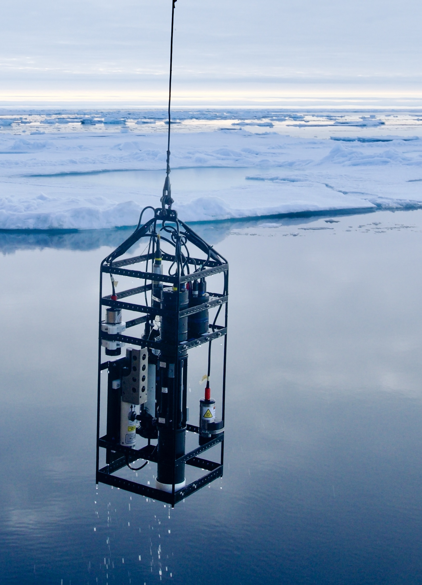
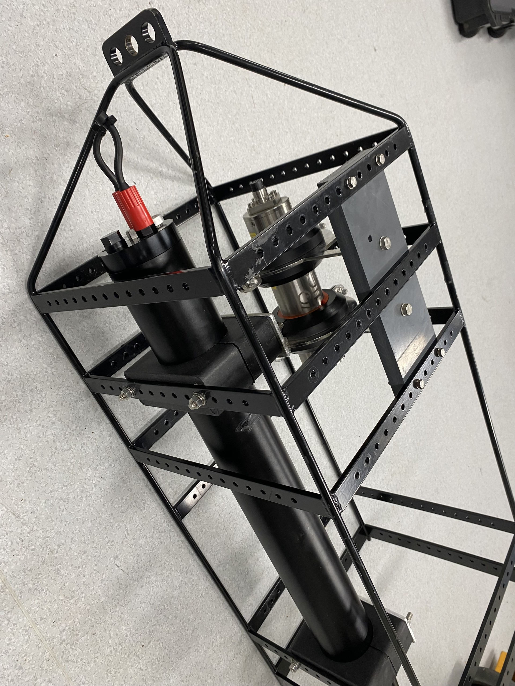
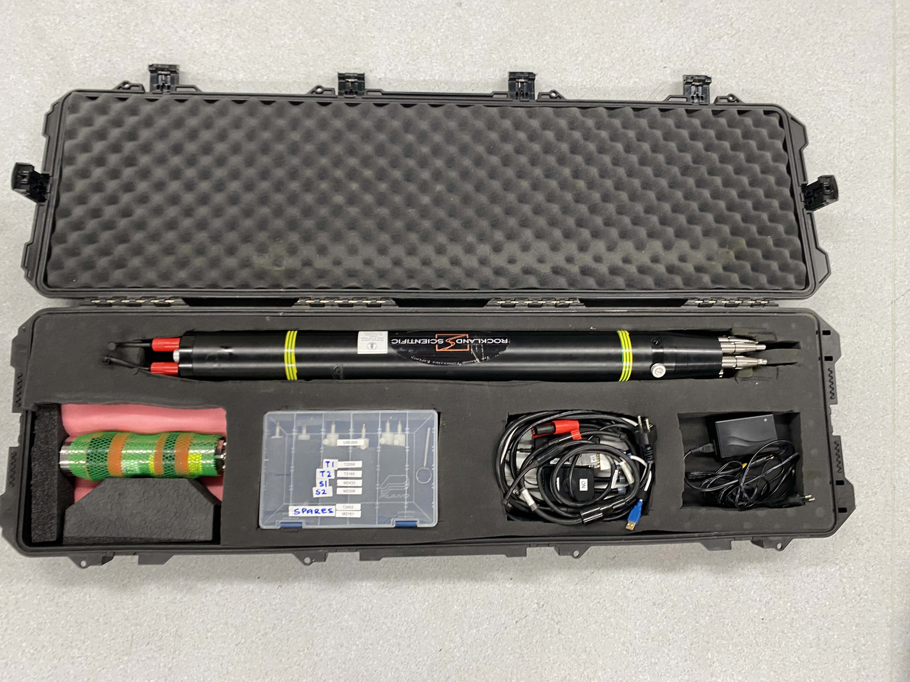

# MicroRider-1000

## Vertical Profiling Frame

This field guide describes the procedures for preparing, configuring, deploying and recovering the **Rockland Scientific MicroRider-1000** when mounted in the vertical profiling frame.

<figure markdown>

{ width="100%" }

<figcaption><strong>Figure 1.</strong> Vertical profiling frame during deployment.</figcaption>

</figure>

<figure markdown>

{ width="100%" }

<figcaption><strong>Figure 2.</strong> MicroRider-1000 partially mounted on the vertical profiling frame in lab.</figcaption>

</figure>

<figure markdown>

{ width="100%" }

<figcaption><strong>Figure 3.</strong> Standard transport case containing the instrument, accessories and spare probes.</figcaption>

</figure>

!!! note "Scope"

    The complete instrument reference is available in the
    [Rockland Scientific Instruments (RSI) MicroRider-1000 User Manual](../../assets/manuals/Manual_MR1000_190328.pdf).

!!! warning "Fragile microstructure probes"

    The shear probes and FP07 temperature probes are extremely fragile. Even light contact with fingers, clothing, or other objects can permanently damage the sensing tips.If possible keep protective guard installed until just before deploying, and always handle the probes by their base.

## Procedures

1. Required Equipment
2. Mount the Instrument
3. Program & Bench Test
4. Install the Probes
5. Pre-deployment Checklist
6. Recovery
7. Download Data
8. Cleaning & Storage
9. Troubleshooting
10. Appendix
