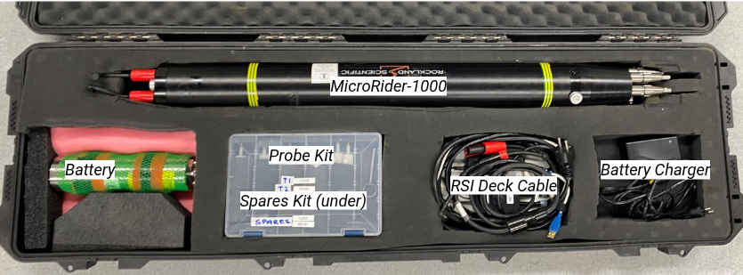

# Required Equipment

The following equipment is required to prepare and configure the **MicroRider-1000** for deployment on a vertical profiling frame.

## Equipment

| Item | Qty | Notes |
|------|:---:|------|
| RSI MicroRider-1000 | 1 | Instrument with dummy probes installed |
| Vertical profiling frame | 1 | Complete with mounting hardware |
| External battery | 1 | Fully charged |
| Windows PC | 1 | With Tera Term and RSILink software installed |
| RSI Deck cable and deck unit | 1 | FTDI serial-to-USB converter included |
| MicroRider and battery Y cable | 1 | |
| Shear probes | 2 | Stored in probe box |
| FP07 temperature probes | 2 | Stored in probe box |
| Probe installation tool | 1 | Stored in probe box |

## Consumables and Tools

| Item | Qty | Notes |
|------|:---:|------|
| Metric hex key set | 1 | |
| Metric socket set | 1 | |
| Silicone grease | 1 | For Bulkhead connectors and probe installation |
| Kimwipes | As required | Cleaning and drying components |
| Battery charger | 1 | Optional if battery requires charging |

!!! note "Transport case"

    The MicroRider-1000 is stored and transported in its transport case. Before leaving for the vessel, verify that all equipment listed above is present.

	<figure markdown>

	{ width="75%" }

	<figcaption>

	**Figure 1.** Transport case showing the storage locations of the MicroRider-1000 and associated equipment.</figcaption>
	</figure>
 
## Final Check

Before continuing, confirm that:

- [ ] All equipment is available.
- [ ] Consumables and tools are available.
- [ ] External battery is fully charged.
- [ ] The MicroRider-1000 and accessories are free from visible damage.
